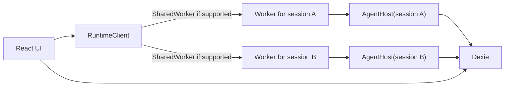
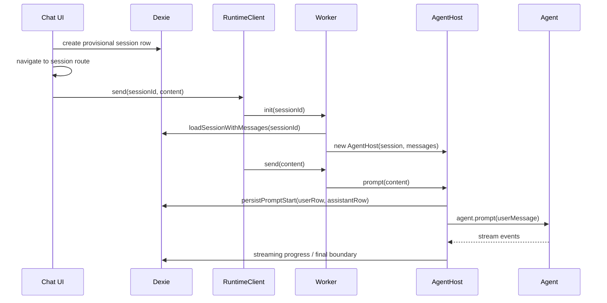

# Agent Runtime Research

Date: 2026-03-27

Scope:
- `src/agent/*`
- runtime call sites in `src/components/chat.tsx`, `src/hooks/use-runtime-session.ts`, `src/sessions/session-actions.ts`, `src/sessions/session-service.ts`
- runtime persistence in `src/db/schema.ts`
- focused tests:

```sh
bun run test tests/runtime-client.test.ts tests/agent-host-persistence.test.ts
```

Result:
- `24/24` tests passed across `tests/runtime-client.test.ts` and `tests/agent-host-persistence.test.ts`

---

## TL;DR

The current architecture is not "one global SharedWorker."

It is effectively:

- one worker handle per session id in the UI client
- one worker instance per session id in browsers that support `SharedWorker`
- one `AgentHost` per worker instance
- Dexie as the source of truth
- worker memory as a warm runtime cache

That means the system already behaves like "one runtime per conversation/session," not "one runtime for the whole app."

The important consequences:

1. `SharedWorker` support does **not** mean there is one giant background agent process.
2. The worker currently holds exactly one `host` and one `activeSessionId`, so the worker API is single-session by design.
3. Different session ids produce different worker instances.
4. The runtime is rehydratable because the authoritative state is persisted in Dexie.
5. The brittle part is not mainly SharedWorker itself. The brittle part is the **bootstrap lifecycle** for the first send:
   - create session
   - navigate
   - init worker
   - persist optimistic rows
   - stream
   - recover if something fails before the prompt is durably established

That bootstrap path is modeled today through side effects and heuristics, not an explicit state machine.

Your `bootstrapStatus` idea is correct. It matches the actual failure boundary in this codebase.

---

## 1. What Each File In `src/agent/` Does

### `agent-host.ts`

This is the real runtime core.

It owns:

- `Agent` construction
- model selection updates
- thinking level updates
- repo tool injection
- prompt bootstrap persistence
- stream lifecycle persistence
- system/runtime notices
- usage recording
- abort/dispose behavior

This file is where most hidden coupling lives.

Key points:

- `prompt()` creates optimistic user + assistant rows before calling the model
- `handleEvent()` persists stream updates and final boundaries
- `createRuntime()` creates repo tools only when the session has a repo source
- `dispose()` stops further persistence and aborts the stream

Primary code:
- `src/agent/agent-host.ts`

### `session-persistence.ts`

This is the durable-state adapter between `AgentHost` and Dexie.

It is responsible for:

- assigning stable persisted assistant ids
- writing optimistic rows at prompt start
- incrementally persisting stream progress
- writing final session/message state
- recording usage once
- appending local system messages

Important detail:

- `persistPromptStart()` is the real durability threshold for "the first prompt exists as a real conversation event"

That is the exact seam where a `bootstrap -> ready` promotion belongs.

Primary code:
- `src/agent/session-persistence.ts`

### `runtime-client.ts`

This is the browser-side worker manager.

It does:

- choose `SharedWorker` if available
- fall back to `Worker` if unavailable or construction throws
- cache worker handles by `sessionId`
- call `init(sessionId)` before first mutation
- expose high-level methods like `send`, `abort`, `setModelSelection`, `releaseSession`

Important detail:

- the worker name is `gitinspect-session-${sessionId}`
- that means the worker namespace is per session id, not global

Primary code:
- `src/agent/runtime-client.ts`

### `runtime-worker.ts`

This is only the bridge layer.

It:

- detects `SharedWorker` shape via `onconnect`
- exposes the worker API through Comlink
- otherwise exposes the same API directly for a dedicated worker

This file does not own session logic. It only chooses the wiring shape.

Primary code:
- `src/agent/runtime-worker.ts`

### `runtime-worker-api.ts`

This is the actual worker-side session API implementation.

It currently uses module-level state:

- `let host: AgentHost | undefined`
- `let activeSessionId: string | undefined`

That means:

- one worker instance can only serve one session at a time
- this is intentional and matches the per-session worker naming

This file answers the "per assistant or global?" question directly:

- today the design is **per session worker**

Primary code:
- `src/agent/runtime-worker-api.ts`

### `runtime-worker-types.ts`

Comlink-exposed API contract:

- `init`
- `send`
- `abort`
- `dispose`
- `refreshGithubToken`
- `setModelSelection`
- `setThinkingLevel`

### `runtime-command-errors.ts`

Defines the two important worker command failures:

- `busy`
- `missing-session`

This is how the client translates worker failures into user-facing messages.

### `runtime-errors.ts` and `runtime-notice-service.ts`

These classify runtime/repo/provider failures into local system messages.

This is why repo or provider failures can appear as system notices in-chat rather than only as thrown exceptions.

### `message-transformer.ts`

Transforms persisted/agent messages into LLM input form.

Key behavior:

- filters out non-LLM roles
- reorders tool results after assistant tool calls

### `provider-stream.ts`

Wraps provider streaming and normalizes it into the app's assistant-message stream.

Important behavior:

- strips empty trailing assistant placeholders from context
- converts provider stream events into normalized assistant partials
- synthesizes error assistant messages on stream failure

### `provider-proxy.ts`

Applies proxy routing when needed for supported providers.

### `system-prompt.ts`

Defines the runtime system prompt for the gitinspect agent.

---

## 2. Actual Topology

The runtime topology today is:



That is the key thing to internalize:

- the UI does not subscribe to a live agent directly
- the UI reacts to Dexie
- the worker is just a command executor plus warm in-memory runtime

This is cleaner than Sitegeist-style direct agent ownership in the page, but it also means lifecycle bugs tend to come from the seam between:

- provisional session row
- worker init
- first durable prompt persistence

---

## 3. SharedWorker Lifecycle In This Codebase

### What gets created?

`RuntimeClient.createWorker(sessionId)` names each worker with the session id:

- `gitinspect-session-sess-a`
- `gitinspect-session-sess-b`

That means:

- same `sessionId` -> same named `SharedWorker` namespace
- different `sessionId` -> different `SharedWorker` namespace

This is validated by `tests/runtime-client.test.ts`.

So the answer to:

> should we have a shared worker per agent assistant?

is:

- you already do, effectively
- specifically: one worker per session/conversation, not one worker for the whole app

### What is shared across tabs?

In `SharedWorker` browsers:

- if two tabs connect to the same script URL and the same worker name
- they can attach to the same underlying worker instance

Because the name includes the `sessionId`, the sharing boundary is:

- **shared per session across tabs**
- **not shared across different sessions**

### When does the worker stop?

Practically:

- dedicated worker: stops when terminated or when its owning page goes away
- shared worker: can stay alive while at least one connected document/port keeps it alive
- once all ports are closed and no page is using it, the browser is free to terminate it

Important nuance:

- `SharedWorker` lifetime is browser-managed
- you should not depend on exact shutdown timing

In this app that is okay because:

- Dexie is the source of truth
- worker memory is reconstructible

### What happens on reload?

If the page reloads:

- the in-page `RuntimeClient` instance is destroyed
- its ports/worker handles go away
- the shared worker may or may not still remain alive, depending on whether another page still holds a port

On the next send or mutation:

- a new `RuntimeClient` instance is created
- it creates a worker handle again
- `init(sessionId)` runs
- if the old worker still exists and matches the same named worker, it can continue
- if not, the worker will rehydrate from Dexie via `loadSessionWithMessages()`

So persistence does not depend on keeping workers alive.

### What happens when we explicitly release?

`runtimeClient.releaseSession(sessionId)`:

1. calls worker-side `dispose()`
2. closes the shared worker port or terminates the dedicated worker
3. removes the handle from the client map

This happens today when deleting a session, not when simply switching away from it.

That means idle workers can accumulate for visited sessions in a tab until:

- delete
- reload
- browser teardown

This is one reason the current setup can feel heavier than it needs to.

---

## 4. Current Worker Ownership Model

`runtime-worker-api.ts` is very explicit:

- one module-level `host`
- one module-level `activeSessionId`

So the ownership model is:

- one `AgentHost` per worker instance
- one session per worker instance

Because `runtime-client.ts` creates a worker per session id, these layers match each other.

That alignment is good.

What would be broken is:

- keeping `runtime-worker-api.ts` single-host
- but moving to one global shared worker name for all sessions

That would cause session collisions immediately.

So if you ever want one true global SharedWorker, `runtime-worker-api.ts` must become:

```ts
const hosts = new Map<string, AgentHost>()
```

not:

```ts
let host
let activeSessionId
```

---

## 5. First-Send Lifecycle

This is the lifecycle that matters most for your bootstrap proposal.

### Current sequence



### Where the provisional session is created

`createSessionForChat()` / `createSessionForRepo()`:

- create a `SessionData`
- persist it immediately
- return it to the UI

At this point the session exists in Dexie, but it is still only a shell:

- no message rows
- `isStreaming: false`
- no guarantee first prompt bootstrap will succeed

This is why the current system needs heuristics later.

### Where the prompt becomes real

The real bootstrap boundary is:

```ts
await this.persistence.persistPromptStart(userRow, assistantRow)
```

in `AgentHost.prompt()`.

That is the exact moment where the session stops being a shell and becomes a real conversation.

This is why a state machine should promote to `ready` **after** `persistPromptStart()` succeeds, not after session creation.

---

## 6. Streaming Lifecycle

Once the first prompt is durably established:

1. `AgentHost.handleEvent()` receives stream events
2. if still streaming:
   - it persists the current assistant draft
   - it persists newly completed rows
3. if a `turn_end` includes tool results:
   - it rotates to a new assistant id for the next assistant phase
4. when streaming finishes:
   - it persists final session boundary
   - clears `isStreaming`
   - clears active draft pointers

Important specificities:

- assistant ids are stable at the persistence layer, not necessarily the raw upstream event ids
- tool result rows are attached to the active assistant id
- usage is recorded only once per final assistant message

This part is actually fairly well structured.

The awkwardness is before this lifecycle starts.

---

## 7. Error And Abort Lifecycle

### Error after `persistPromptStart()`

If `persistPromptStart()` has already succeeded and the model prompt fails:

- the session should stay
- the assistant row should be converted into an errored assistant row
- the session error should be persisted
- optional system/runtime notices may be appended

That is exactly what the current code already does reasonably well.

### Error before `persistPromptStart()`

This is the brittle case.

If a failure happens before the first optimistic rows are durably written, the app currently has:

- a session row
- maybe a route navigation
- maybe a worker handle
- no real conversation rows yet

That is why `Chat` currently has `persistDetachedSendError()` style cleanup logic: it is inferring a bootstrap failure from side effects.

That inference is the fragile part.

### Abort

Abort is simpler:

- `runtimeClient.abort(sessionId)` forwards to worker `abort()`
- `AgentHost.abort()` marks terminal status as `"aborted"` and aborts the agent
- persistence layer eventually writes an aborted assistant row when the stream settles

---

## 8. Why The Current Setup Feels Brittle

The shared worker is only part of the story.

The deeper reasons are:

### 8.1 Bootstrap is implicit

The system currently infers meaning from:

- session exists
- session has zero or more rows
- `isStreaming` true or false
- `error` present or absent
- worker exists or not

That is too indirect for first-send recovery.

### 8.2 Session creation and conversation creation are conflated

Today:

- `createSessionForChat/createSessionForRepo` persists a normal-looking session immediately

But semantically that session is not normal yet. It is still provisional.

### 8.3 Idle worker retention is under-managed

Workers are cached by session id in `RuntimeClient.workers`.

They are released when:

- session is deleted

They are not released when:

- the user switches away
- the stream completes
- the session becomes long-idle

That means the runtime lifecycle is longer than the product lifecycle really needs.

### 8.4 There is no explicit "active runtime vs persisted session shell" distinction

Dexie stores the session row.
Worker memory stores the warm runtime.
The code does not explicitly model when a persisted session shell should be considered a real conversation.

That is exactly what `bootstrapStatus` would fix.

---

## 9. Should We Keep A Worker Per Session?

Short answer:

- per-session runtime ownership is a reasonable model
- per-session worker lifetime for every touched session is not ideal

### Why per-session ownership is reasonable

It gives you:

- easy isolation
- no cross-session state contamination
- clear busy semantics
- natural shared-across-tabs behavior for the same conversation

### Why per-session workers forever are not ideal

An idle worker currently mostly holds:

- an `AgentHost`
- tool/runtime setup
- warm in-memory state derived from Dexie

It is **not** doing meaningful background work once idle.

So if you keep many idle session workers around, you are paying complexity and memory for very little product value.

### Practical conclusion

Best product/runtime tradeoff for this repo:

- keep **per-session runtime semantics**
- do **not** keep every session worker alive indefinitely

That can be achieved in two ways.

#### Option A: keep current per-session worker model, add idle eviction

This is the smallest change.

Do:

- keep one worker per session id
- release idle workers after a timeout or when leaving the session
- reconstruct from Dexie on demand

This preserves the existing architecture and reduces lingering runtime state.

#### Option B: move to one global SharedWorker runtime manager

This is architecturally cleaner long-term, but bigger:

- one `SharedWorker`
- `Map<sessionId, AgentHost>`
- explicit per-session idle eviction
- explicit bootstrap lifecycle per host

This is a better systems design if you expect many sessions and want true centralized runtime management.

But it is not a small refactor.

---

## 10. Should We Leave It Running In The Background?

Not by default for every session.

Reasons:

1. the runtime is not the source of truth; Dexie is
2. there is no long-running background job model here
3. idle runtime state is mostly just a warm cache
4. recovery from worker loss is already possible through `init(sessionId)` + Dexie rehydration

So background longevity should be a policy choice, not the default behavior of every touched session.

Good rule:

- keep the runtime alive while the session is active or streaming
- optionally keep it warm for a short idle window
- then dispose it

That matches what the code actually needs.

---

## 11. Recommended Direction

Your proposal is the right direction.

The most practical architecture for this repo is:

### 11.1 Add a persisted bootstrap state machine

Add to `SessionData`:

```ts
type BootstrapStatus = "bootstrap" | "ready" | "failed"
```

Semantics:

- `bootstrap`
  - session shell exists
  - first prompt not durably established yet
- `ready`
  - `persistPromptStart()` succeeded at least once
  - normal chat behavior applies
- `failed`
  - bootstrap failed before promotion
  - UI can offer retry or discard

For v0, rollback-on-failure is also reasonable:

- if `bootstrapStatus !== "ready"` and there are no message rows, the session is provisional and can be discarded safely

### 11.2 Introduce `bootstrapSessionAndSend(...)`

Move first-send orchestration out of `chat.tsx`.

That coordinator should own:

1. create provisional session
2. persist `bootstrapStatus: "bootstrap"`
3. navigate
4. init runtime
5. send
6. wait for first prompt durability threshold
7. mark `ready` or roll back

That will remove the current ad hoc bootstrap-recovery logic from the UI.

### 11.3 Keep per-session runtime semantics, but add lifecycle policy

Near-term recommendation:

- keep the current per-session worker model
- add explicit idle release
- do not keep dormant workers forever

Long-term recommendation:

- if runtime complexity keeps growing, migrate from:
  - "one worker instance per session"
- to:
  - "one global runtime manager worker with `Map<sessionId, AgentHost>`"

But only do that if you actually need centralized scheduling or many concurrent session runtimes.

### 11.4 Change the UI contract

The UI should stop treating:

- `messages.length === 0`

as sufficient to show the normal empty chat state.

Instead:

- `bootstrap` -> show starting/provisional UI
- `ready && messages.length === 0` -> show normal empty chat
- `failed` -> show retry/discard treatment

That is the cleanest way to stop the "repo card flashes even though bootstrap is broken" class of bugs.

---

## 12. Concrete Answers To Your Questions

### "What is the lifecycle of a shared worker when it stops?"

In this app:

- a shared worker is created lazily on first runtime mutation for a session
- it is keyed by session id through the worker name
- it can outlive a single tab if another tab still holds a port to the same named worker
- it can be explicitly disposed through `releaseSession()`
- otherwise the browser may terminate it once no pages hold ports anymore
- when it dies, the app can rehydrate from Dexie on next init

### "When we send messages what happens?"

Current flow:

1. UI creates a provisional session row in Dexie
2. UI navigates to that session
3. `runtimeClient.send(sessionId, content)` runs
4. runtime client creates/gets worker for that session id
5. worker `init(sessionId)` loads session + messages from Dexie
6. worker builds `AgentHost`
7. `AgentHost.prompt()` writes optimistic user + assistant rows via `persistPromptStart()`
8. only then does the actual model prompt run
9. stream updates persist incrementally
10. completion/error/abort persists final session boundary

### "Should we have a shared worker per assistant assistant or one background thing?"

Current answer:

- you effectively have one worker per session already

Recommended answer:

- keep per-session runtime ownership
- do not keep all of them alive forever
- add bootstrap state
- add idle release

If later you want a single background thing, do it intentionally with a real runtime manager and a `Map<sessionId, AgentHost>`, not by collapsing the current single-host worker API into one shared name.

---

## 13. Bottom Line

The current architecture is closer to being good than it looks.

The major issue is not that SharedWorker exists.
The major issue is that bootstrap is implicit.

The clean model for this repo is:

- persisted provisional session
- explicit bootstrap state
- promote on `persistPromptStart()`
- roll back provisional failures
- keep runtime ownership per session
- do not keep idle session workers around forever

That gives you:

- cleaner recovery
- simpler UI logic
- fewer zombie sessions
- fewer hidden invariants
- a better foundation whether you stay per-session-worker or later move to a global runtime manager

